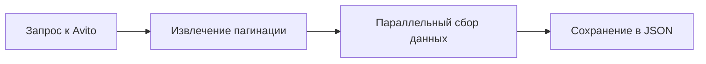

# 🚀 Анализ данных недвижимости с Avito

> Умный скрапер и анализатор данных с использованием Firecrawl и E2B Code Interpreter

## 📊 Что умеет этот проект?

Этот проект представляет собой интеллектуальный инструмент для:
- 🔍 Автоматического сбора данных о недвижимости с Avito
- 📈 Визуализации распределения различных параметров (цена, рейтинг и др.)
- 🤖 Умного анализа данных с помощью AI
- 📊 Гибкой настройки параметров анализа

## 🛠 Как это работает?

### 1. Сбор данных (Firecrawl)


1. Подключается к Avito через Firecrawl API
2. Умно обходит пагинацию
3. Соб��рает данные о каждом объявлении
4. Сохраняет в структурированном формате

### 2. Анализ данных (E2B + Claude)


1. Загружает собранные данные
2. Выбирает параметры для анализа:
   - Тип параметра (цена, рейтинг и т.д.)
   - Название графика
   - Количество интервалов для гистограммы
3. Генерирует Python код для анализа
4. Выполняет код в защищенной среде
5. Создает визуализации для каждого параметра

## 🚀 Быстрый старт

### Предварительные требования

- ✅ Node.js на вашем компьютере
- 🔑 API ключи:
  - E2B API ([получить здесь](https://e2b.dev/docs/getting-started/api-key))
  - Firecrawl API ([получить здесь](https://firecrawl.dev))
  - Anthropic API ([получить здесь](https://anthropic.com))

### Установка

1. **Установите зависимости:**
   ```bash
   npm install
   ```

2. **Настройте окружение:**
   - Скопируйте `.env.template` в `.env`
   - Добавьте ваши API ключи

3. **Запустите проект:**
   ```bash
   npm run start
   ```

## 🔬 Технические детали

### Архитектура проекта

- `scraping.ts` - Модуль сбора данных
  - Использует Firecrawl для умного скрапинга
  - Имеет встроенную защиту от блокировок
  - Поддерживает параллельный сбор данных

- `index.ts` - Основной модуль
  - Оркестрирует процесс анализа
  - Взаимодействует с Claude AI
  - Управляет выполнением кода

- `model.ts` - Конфигурация AI
  - Настройки модели Claude
  - Промпты для анализа
  - Инструменты для выполнения кода

### Параметры анализа

1. **Сбор данных:**
   - Умное определение пагинации
   - Параллельный сбор с задержками
   - Промежуточное сохранение результатов
Проект поддерживает гибк��ю настройку параметров анализа через интерфейс `AnalysisParams`:

```typescript
interface AnalysisParams {
  parameter: string;   // Параметр для анализа
  title?: string;      // Заголовок графика
  bins?: number;       // Количество интервалов
}
```

**Примеры использования:**
   - Автоматическая генерация Python кода
   - Выполнение в изолированной среде
   - Создание визуализаций
1. **Анализ цен:**
   ```typescript
   const priceAnalysis = {
     parameter: 'price_per_night',
     title: 'Распределение цен на недвижимость',
     bins: 50
   }
   ```

2. **Анализ рейтингов:**
   ```typescript
   const ratingAnalysis = {
     parameter: 'rating',
     title: 'Распределение рейтингов',
     bins: 20
   }
   ```

3. **Кастомный анализ:**
   ```typescript
   const customAnalysis = {
     parameter: 'your_parameter',
     title: 'Ваш заголовок',
     bins: 30
   }
   ```

### Результаты анализа

Для каждого анализируемого параметра создается:
- 📊 Гистограмма распределения
- 📈 Базовая статистика (среднее, медиана, мода)
- 💾 Отдельный файл с графиком (`avito_parameter_distribution.png`)

## 📈 Примеры использования

1. **Базовый анализ цен:**
   ```typescript
   // Создаем параметры анализа
   const analysisParams = [{
     parameter: 'price_per_night',
     title: 'Распределение цен на недвижимость',
     bins: 50
   }];

   // Запускаем анализ
   await runAnalysis(analysisParams);
   ```

2. **Множественный анализ:**
   ```typescript
   // Анализируем несколько параметров
   const analysisParams = [
     {
       parameter: 'price_per_night',
       title: 'Цены',
       bins: 50
     },
     {
       parameter: 'rating',
       title: 'Рейтинги',
       bins: 20
     },
     {
       parameter: 'reviews',
       title: 'Количество отзывов',
       bins: 30
     }
   ];
   ```

## 🤝 Вклад в проект

Мы открыты для улучшений! Вот как вы можете помочь:
- 🐛 Сообщайте о багах
- 💡 Предлагайте новые функции
- 🔧 Отправляйте pull requests

## 📝 Лицензия

Этот проект распространяется под лицензией MIT. Полный текст лицензии доступен в файле [LICENSE](LICENSE).

Краткое описание:
- ✅ Можно использовать в коммерческих целях
- ✅ Можно изменять и распространять
- ✅ Можно использовать в частных проектах
- ❗ Требуется указание авторства
- ❗ Автор не несет ответственности за последствия использования

## 🤔 Часто задаваемые вопросы

1. **Q: Почему используется Claude AI?**  
   A: Claude отлично генерирует Python код для анализа данных и может адаптироваться к различным типам данных.

2. **Q: Как избежать блокировок?**  
   A: Проект использует умные задержки и повторные попытки при ошибках.

3. **Q: Можно ли анализировать другие категории?**  
   A: Да, достаточно изменить URL и схему данных в `scraping.ts`.

## 🎯 Планы по развитию

- [ ] Добавить веб-интерфейс
- [ ] Расширить типы анализа
- [ ] Добавить поддержку других площадок
- [ ] Улучшить визуализацию данных

## 📞 Контакты

Если у вас есть вопросы или предложения, создайте issue в репозитории!