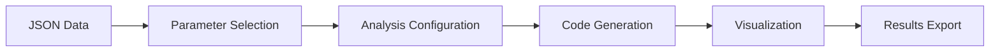

# Product Requirements Documentation - Algorithm Description

## 1. Project Overview

The project is a data scraping and analysis system designed to collect and visualize Avito real estate data using Firecrawl for web scraping and E2B's Code Interpreter for data analysis. The system supports flexible parameter selection for data visualization and analysis.

## 2. Core Components

### 2.1. Data Collection Module

**Component**: Web Scraping Engine (scraping.ts)
**Technology**: Firecrawl API
**Purpose**: Automated collection of Avito listing data

Process Flow:
- Initialize Firecrawl with API credentials
- Target initial URL (Moscow Avito listings)
- Extract pagination links
- For each page:
  - Scrape listing details including:
    - Title
    - Price per night
    - Location
    - Rating (if available)
    - Number of reviews (if available)
- Store collected data in JSON format

### 2.2. Data Processing Module

**Component**: Code Interpreter (codeInterpreter.ts)
**Technology**: E2B Code Interpreter SDK
**Purpose**: Data analysis and visualization

Process Flow:
1. Load collected data from JSON file
2. Accept analysis parameters:
   - Target parameter for analysis (e.g., price, rating)
   - Visualization settings (bins, title)
   - Statistical requirements
3. Process data through Python environment
4. Generate statistical analysis
5. Create visualizations
6. Export results

### 2.3. Parameter Selection Interface

**Component**: Analysis Parameters Interface
**Technology**: TypeScript
**Purpose**: Configure analysis settings

```typescript
interface AnalysisParams {
  parameter: string;   // Parameter to analyze
  title?: string;      // Graph title
  bins?: number;       // Number of histogram bins
}
```

Required Parameters:
- `parameter`: Field name from scraped data to analyze
- `title`: Custom title for the visualization (optional)
- `bins`: Number of intervals for histogram (optional, default: 30)

### 2.4. Integration Layer

**Component**: Main Application (index.ts)
**Technology**: Node.js with TypeScript
**Purpose**: Orchestration and control flow

Process Flow:
- Check for existing data
- Trigger data collection if needed
- Initialize analysis environment
- Process user commands
- Handle output generation

## 3. Data Flow

### 3.1. Data Collection Phase
Web Source → Firecrawl API → JSON Storage

### 3.2. Analysis Phase


## 4. Technical Requirements

### 4.1. API Dependencies
- Firecrawl API key
- E2B API key
- Anthropic API key

### 4.2. Runtime Environment
- Node.js
- TypeScript support
- Python environment (for analysis)

### 4.3. Data Storage
- Local JSON file storage
- Format: Structured JSON with listing details

### 4.4. Analysis Parameters
Required field mappings in scraped data:
- `price_per_night`: Numeric price value
- `rating`: Numeric rating value (optional)
- `reviews`: Number of reviews (optional)
- `location`: Location string
- Additional fields as needed

Parameter validation rules:
1. Numeric fields only for distribution analysis
2. Non-empty values check
3. Range validation where applicable

## 5. Functional Workflow

### 5.1. Initialization
- Load environment variables
- Verify API credentials
- Initialize service connections

### 5.2. Data Collection
- Check for existing data
- If needed, initiate scraping:
  - Connect to Avito
  - Extract listing data
  - Handle pagination
  - Validate data structure
  - Save to storage

### 5.3. Analysis Configuration
1. Define analysis parameters:
   ```typescript
   const analysisParams = [
     {
       parameter: 'price_per_night',
       title: 'Price Distribution',
       bins: 50
     },
     // Additional parameters as needed
   ];
   ```

2. Validate parameters:
   - Check parameter existence in data
   - Verify data type compatibility
   - Validate bin count range

3. Execute analysis:
   - Generate appropriate Python code
   - Create visualizations
   - Save results

### 5.4. Results Generation
For each analyzed parameter:
1. Generate histogram visualization
2. Calculate basic statistics:
   - Mean
   - Median
   - Mode
   - Standard deviation
3. Save visualization to file
4. Log analysis results

## 6. Error Handling

### 6.1. Scraping Errors
- Network timeout handling
- Rate limiting management
- Data validation
- Retry mechanisms

### 6.2. Processing Errors
- Data format validation
- Analysis execution errors
- Resource management

## 7. Output Specifications

### 7.1. Data Storage
- JSON format
- UTF-8 encoding
- Structured listing data

### 7.2. Visualizations
Output requirements per parameter:
1. Histogram plot:
   - Clear title indicating parameter
   - Labeled axes
   - Appropriate bin size
   - Color coding

2. Statistical summary:
   - Basic statistics
   - Data quality metrics
   - Sample size

3. File naming convention:
   ```
   avito_{parameter}_distribution.png
   ```

## 8. Performance Considerations

### 8.1. Scraping Performance
- Parallel processing of pages
- Timeout settings (50000ms default)
- Rate limiting compliance

### 8.2. Analysis Performance
- Memory management
- Processing optimization
- Resource cleanup

## 9. Security Considerations

### 9.1. API Security
- Secure credential storage
- Environment variable usage
- API key management

### 9.2. Data Security
- Local storage security
- Data validation
- Error logging security

## 10. Extensibility

### 10.1. Additional Features
- Support for different visualization types
- Custom parameter combinations
- Advanced statistical analysis
- Data filtering options

### 10.2. Integration Points
- Custom parameter definitions
- Visualization templates
- Analysis presets
- Export format options

### 10.3. Parameter Extension
To add new parameters for analysis:
1. Update data scraping schema
2. Add parameter validation
3. Create visualization template
4. Update documentation

## 11. Usage Examples

### 11.1. Basic Price Analysis
```typescript
const priceAnalysis = {
  parameter: 'price_per_night',
  title: 'Property Price Distribution',
  bins: 50
};
```
```
import FirecrawlApp from '@mendable/firecrawl-js'
import { z } from 'zod'
// Initialize the FirecrawlApp with your API key
const app = new FirecrawlApp({ apiKey: process.env.FIRECRAWL_API_KEY })
// Define schema for data extraction
const paginationSchema = z.object({
page_links: z
.array(
z.object({
link: z.string(),
})
)
.describe('Pagination links in the bottom of the page.'),
})
// Configure scraping parameters
const params = {
pageOptions: {
onlyMainContent: false,
},
extractorOptions: { extractionSchema: paginationSchema },
timeout: 50000,
}
// Start crawling
const linksData = await app.scrapeUrl(listingsUrl, params)
```
### 11.2. E2B Code Interpreter Integration

```
import { Sandbox } from '@e2b/code-interpreter'
export async function codeInterpret(
codeInterpreter: Sandbox,
code: string
) {
// Execute the code in the sandbox
const exec = await codeInterpreter.runCode(code, {
// Optional: Stream logs from the code interpreter
// onStderr: (stderr: string) => console.log("\n[Code Interpreter stdout]", stderr),
// onStdout: (stdout: string) => console.log("\n[Code Interpreter stderr]", stdout),
})
if (exec.error) {
console.log('[Code Interpreter error]', exec.error)
return undefined
}
return exec
}
```
#### 11.2.1. Multiple Parameter Analysis
```typescript
const multiAnalysis = [
  {
    parameter: 'price_per_night',
    title: 'Prices',
    bins: 50
  },
  {
    parameter: 'rating',
    title: 'Ratings',
    bins: 20
  }
];
```

### 11.3. Anthropic API Integration

```
import Anthropic from '@anthropic-ai/sdk'
const anthropic = new Anthropic()
async function chat(
codeInterpreter: Sandbox,
userMessage: string
): Promise<Execution | undefined> {
// Create a message using Anthropic's Claude
const msg = await anthropic.messages.create({
model: MODEL_NAME,
system: SYSTEM_PROMPT,
max_tokens: 4096,
messages: [{ role: 'user', content: userMessage }],
tools,
})
// Handle tool usage in response
if (msg.stop_reason === 'tool_use') {
const toolBlock = msg.content.find((block) => block.type === 'tool_use')
const toolName = toolBlock?.name ?? ''
const toolInput = toolBlock?.input ?? ''
// Process tool usage...
}
}
```

#### 11.3.1. Custom Analysis
```typescript
const customAnalysis = {
  parameter: 'custom_field',
  title: 'Custom Analysis',
  bins: 30
};
```